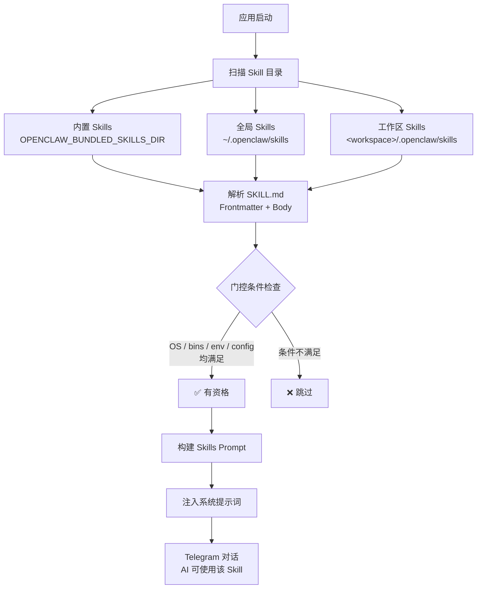

# Skills 使用指南

OpenClaw 通过 **Skills** 机制扩展 AI 助手的能力。每个 Skill 是一个包含 `SKILL.md` 文件的目录，里面定义了技能的名称、描述、使用条件和详细指令。Skills 在启动时自动加载并注入到系统提示词中，让 AI 助手"学会"使用特定工具和执行特定任务。

---

## 快速开始

### 1. 创建自定义 Skill

当前 Java 实现会从工作区下的 `.openclaw/skills/<skill-name>/SKILL.md` 加载 Skill：

```
.openclaw/
└── skills/
    └── my-translator/
        └── SKILL.md
```

`SKILL.md` 最小模板：

```markdown
---
description: 将用户输入的文本翻译为指定语言
---

# 翻译助手

当用户要求翻译时，遵循以下规则：
1. 自动检测源语言。
2. 默认翻译为中文，除非用户指定其他目标语言。
3. 保留原文格式，例如代码块、列表和换行。
```

> [!NOTE]
> 当前实现里 Skill 的实际名称取自目录名 `my-translator`，不是 frontmatter 里的 `name` 字段。

### 2. 在对话中使用

启动 OpenClaw 后，在对话中直接使用即可。当前 Java 实现的主路径是：把 Skill 正文注入系统提示词，让模型在合适场景下参考这些规则。

```
用户: 帮我把这段英文翻译成日语：Hello, how are you?
Bot:  こんにちは、お元気ですか？
```

> [!NOTE]
> `user-invocable` 和 `disable-model-invocation` 目前会被解析，但当前 Java 版的斜杠命令注册和 direct-dispatch 链路尚未完整接通。编写 Skill 时，优先把它当作“提示词注入的指令文档”来设计。

---

## Skill 目录和优先级

Skills 从以下位置加载，名称冲突时按优先级覆盖：

| 优先级 | 位置 | 说明 |
|--------|------|------|
| 🔴 最高 | `<workspace>/.openclaw/skills/` | 工作区自定义 Skills |
| 🟡 中 | `~/.openclaw/skills/` | 全局共享 Skills |
| 🟢 最低 | 内置 Skills（随发行包） | 系统预置 Skills |

> [!TIP]
> 可通过环境变量 `OPENCLAW_BUNDLED_SKILLS_DIR` 自定义内置 Skills 的路径。

---

## SKILL.md 格式详解

### 当前实现支持的 Frontmatter 规则

Frontmatter 必须位于文件最开头，并使用 `---` 包裹。

当前 Java 解析器只支持非常简单的顶层 `key: value` 形式，不是完整 YAML。也就是说：

- 支持顶层简单键值对，例如 `description: xxx`
- 支持续行文本，但不会把缩进块当作 YAML 对象或数组
- 不支持通过 YAML 缩进语法声明嵌套对象
- `metadata` 的值必须是一个 JSON 对象字符串，解析器会再用 JSON 方式读取它

推荐写法：

```markdown
---
description: 通过 Gemini 生成或编辑图片
user-invocable: true
disable-model-invocation: false
metadata: { "openclaw": { "requires": { "bins": ["uv"], "env": ["GEMINI_API_KEY"] }, "primaryEnv": "GEMINI_API_KEY", "emoji": "🎨", "os": ["darwin", "linux"] } }
---
```

| 字段 | 类型 | 默认值 | 说明 |
|------|------|--------|------|
| `description` | string | 空字符串 | 当前唯一稳定参与加载与提示词构建的基础字段 |
| `name` | string | — | 可写但当前 Java 实现不用于 Skill 命名，实际名称取目录名 |
| `user-invocable` | bool | `true` | 当前会被解析，但下游调用链路尚未完整接通 |
| `disable-model-invocation` | bool | `false` | 当前会被解析，但尚未在提示词注入阶段生效 |
| `metadata` | JSON | — | 门控条件和扩展元数据（见下文） |

不建议依赖但文档中曾出现过的字段：

- `command-dispatch`
- `command-tool`
- `command-arg-mode`

这些字段在当前 Java 代码里没有看到稳定的消费链路，暂时不要把它们当作已生效能力。

### Metadata 门控条件

`metadata` 必须写成 JSON 字符串，其中的 `openclaw` 对象控制 Skill 的加载条件：

```json
{
  "openclaw": {
    "always": false,
    "emoji": "🔧",
    "homepage": "https://example.com",
    "os": ["darwin", "linux"],
    "primaryEnv": "MY_API_KEY",
    "requires": {
      "bins": ["ffmpeg"],
      "anyBins": ["chrome", "chromium"],
      "env": ["MY_API_KEY"],
      "config": ["browser.enabled"]
    }
  }
}
```

| 门控字段 | 说明 |
|----------|------|
| `always: true` | 始终加载，跳过其他条件检查 |
| `skillKey` | Skill 配置覆盖时使用的标识；未设置时回退为目录名 |
| `os` | 操作系统过滤：`darwin`、`linux`、`win32` |
| `requires.bins` | PATH 中必须存在**全部**二进制 |
| `requires.anyBins` | PATH 中存在**任一**二进制即可 |
| `requires.env` | 必须设置的环境变量，或可由配置注入满足 |
| `requires.config` | `openclaw.json` 中必须为真值的配置路径 |
| `primaryEnv` | 与 `skills.entries.<skillKey>.apiKey` 关联的环境变量 |
| `emoji` | 展示用元数据 |
| `homepage` | 展示用元数据 |

### Body 内容

Frontmatter 之后的 Markdown 内容是 Skill 的**详细指令**，会被完整注入到系统提示词，并最终包装成：

```xml
<skill name="目录名">
...正文...
</skill>
```

在这里你可以：

- 描述详细的使用规则和步骤
- 指定工具调用格式和参数
- 定义输出格式要求
- 明确什么时候该使用某个工具，以及什么时候不要使用

> [!TIP]
> 当前最稳妥的写法是：把 body 当成给模型看的 SOP，不要把业务逻辑寄托在 frontmatter 的高级字段上。

### 当前最小模板

如果你只是想让模型学会一套额外规则，最小可用模板如下：

```markdown
---
description: 说明这个 skill 处理什么问题
---

# Skill 标题

这里写具体规则：
1. 什么时候触发。
2. 应该调用什么工具或采取什么步骤。
3. 输出需要满足什么格式。
4. 哪些情况下必须先追问，不能猜。
```

---

## 配置覆盖

### 在 openclaw.json 中配置

通过 `skills.entries` 可以为每个 Skill 单独配置：

```json
{
  "skills": {
    "entries": {
      "my-translator": {
        "enabled": true,
        "apiKey": "sk-xxx",
        "env": {
          "TRANSLATOR_API_KEY": "sk-xxx"
        }
      },
      "unused-skill": {
        "enabled": false
      }
    },
    "allowBundled": ["web-search", "image-gen"]
  }
}
```

| 配置项 | 说明 |
|--------|------|
| `enabled` | `false` 强制禁用该 Skill |
| `apiKey` | 为 `primaryEnv` 声明的环境变量提供值 |
| `env` | 注入环境变量（仅在未设置时生效） |
| `allowBundled` | 内置 Skills 白名单（不影响自定义 Skills） |

### 环境变量注入流程

每次 AI 对话运行时：

1. 加载并过滤所有 Skills
2. 为符合条件的 Skill 注入 `env` 和 `apiKey` 到进程环境
3. 构建系统提示词（包含所有有资格的 Skill 指令）
4. 运行结束后恢复原始环境

---

## 在 Telegram 中的使用场景

### 场景一：AI 自动匹配 Skill

最常见的用法——直接对话，AI 根据上下文自动使用合适的 Skill：

```
用户: 帮我搜索一下最近的 Rust 2026 新特性
Bot:  [AI 自动使用 web-search skill，返回搜索结果摘要]
```

### 场景二：通过配置门控控制是否加载

```markdown
---
description: 仅在本机有 docker 时启用
metadata: { "openclaw": { "requires": { "bins": ["docker"] }, "os": ["darwin", "linux"] } }
---
```

满足条件时，这个 Skill 的正文才会被注入系统提示词。

---

## 热重载

OpenClaw 支持 Skills 文件监视。修改 `SKILL.md` 后，下一轮对话会自动使用更新后的内容，**无需重启服务**。

配置项（在 `openclaw.json` 中）：

```json
{
  "skills": {
    "load": {
      "watch": true,
      "watchDebounceMs": 250
    }
  }
}
```

---

## 实用示例

### 示例 1：代码审查 Skill

```markdown
---
description: 对代码进行详细审查，发现潜在问题和改进建议
---

# 代码审查

当用户请求代码审查时：

1. **安全性检查**：SQL 注入、XSS、硬编码密钥
2. **性能分析**：N+1 查询、不必要的循环、内存泄漏
3. **代码风格**：命名规范、注释完整度、函数粒度
4. **最佳实践**：错误处理、日志记录、测试覆盖

输出格式：
- 🔴 严重问题（必须修复）
- 🟡 建议优化
- 🟢 优点和亮点

逐文件分析，附带具体行号和修改建议。
```

### 示例 2：带门控条件的 Skill

```markdown
---
description: Docker 容器管理和 Compose 编排助手
metadata: { "openclaw": { "requires": { "bins": ["docker"] }, "emoji": "🐳", "os": ["darwin", "linux"] } }
---

# Docker 助手

帮助用户管理 Docker 容器、镜像和 Compose 服务。

可用操作：
- 查看运行中的容器状态
- 分析 Dockerfile 和 docker-compose.yml
- 排查容器启动失败问题
- 生成 Docker 配置建议
```

> 此 Skill 仅在 PATH 中有 `docker` 命令且系统为 macOS/Linux 时才会加载。

---

## 常见问题

| 问题 | 原因 | 解决方案 |
|------|------|----------|
| Skill 没有被 AI 使用 | 门控条件不满足 | 检查 `requires` 中的 bins/env/config 是否满足 |
| Skill 加载但 AI 忽略它 | 描述不够明确 | 重写 `description` 和 body，使触发条件更显式 |
| `/skill` 命令不生效 | 当前 Java 版命令注册链路未完整接通 | 优先通过自然语言触发，不要依赖 slash command |
| 修改 Skill 后没生效 | 未开启热重载 | 设置 `skills.load.watch: true` 或重启服务 |
| `enabled: false` 无效 | Skill key 不匹配 | 检查 `metadata.openclaw.skillKey` 与配置的 key 是否一致 |
| `metadata` 不生效 | 写成了 YAML 嵌套对象而不是 JSON 字符串 | 改成 `metadata: { "openclaw": { ... } }` |

---

## 加载流程


